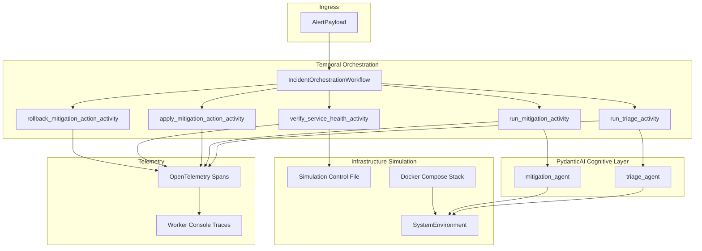

# AegisFlow

Autonomous multi-agent AI incident response engine built with Temporal, PydanticAI, and OpenTelemetry.

AegisFlow ingests observability alerts, triages incidents with PydanticAI agents, plans mitigations with human approval, verifies service health, and executes saga compensation when remediation fails.

## Architecture



### Component topology

| Layer | Responsibility |
|---|---|
| **Domain models** | Pydantic v2 contracts (`AlertPayload`, `IncidentDiagnosis`, `MitigationPlan`) |
| **Agents** | Triage and mitigation PydanticAI agents with tool-backed telemetry |
| **Workflows** | Deterministic Temporal state machine with human approval and saga rollback |
| **Activities** | All I/O, agent execution, health checks, and compensation |
| **Telemetry** | OpenTelemetry spans for activities and LLM token/latency metadata |
| **Simulation** | Live CLI runner and cross-process chaos injection via `.aegisflow/simulation_state.json` |

## Prerequisites

- Python 3.12+
- Docker Desktop (or compatible Docker engine)
- Anthropic/OpenAI credentials for live agent runs (when not using test doubles)

## Quick start

### 1. Start infrastructure

```bash
docker compose up -d
```

| Service | Endpoint |
|---|---|
| Temporal Web UI | http://localhost:8080 |
| Temporal gRPC | localhost:7233 |
| PostgreSQL | localhost:5432 |
| LocalStack (S3/SQS) | http://localhost:4566 |

### 2. Install the project

```bash
python -m venv .venv
source .venv/bin/activate
pip install -e ".[dev]"
```

Optional OTLP export support:

```bash
pip install -e ".[dev,telemetry]"
export AEGISFLOW_OTLP_ENDPOINT=http://localhost:4318/v1/traces
```

Optional explicit LLM provider SDK pins (also installed transitively via `pydantic-ai`):

```bash
pip install -e ".[providers]"
export ANTHROPIC_API_KEY=...   # or OPENAI_API_KEY / XAI_API_KEY
```

### 3. Launch the background worker

In a dedicated terminal:

```bash
source .venv/bin/activate
python -m aegisflow.worker
```

The worker registers `IncidentOrchestrationWorkflow` and all activities on the `aegisflow-task-queue` task queue, with OpenTelemetry console tracing enabled by default.

## Validation

### Static analysis

```bash
ruff check src tests
mypy src tests
```

### Automated tests

```bash
pytest tests/ -v
```

Test suites cover:

- PydanticAI agent contracts (`tests/test_agents.py`)
- Temporal workflow orchestration (`tests/test_workflows.py`)
- Saga compensation and telemetry helpers (`tests/test_advanced_patterns.py`)
- Live simulation control (`tests/test_simulation.py`)

## Live end-to-end simulations

The simulation runner connects to the local Temporal cluster, starts a real workflow for `payments-api`, waits for agent activities, injects scenario controls, auto-approves mitigation, and prints a color-coded summary.

### Success scenario

Ensures the post-mitigation health check passes and the workflow completes as `resolved`.

```bash
python -m aegisflow.simulation_runner --scenario success
```

### Chaos scenario

Writes a simulation control flag consumed by `verify_service_health_activity`, forcing a failed health check and triggering saga rollback (`failed_and_rolled_back`).

```bash
python -m aegisflow.simulation_runner --scenario chaos
```

### Useful flags

```bash
python -m aegisflow.simulation_runner \
  --scenario success \
  --temporal-address localhost:7233 \
  --temporal-ui-base http://localhost:8080 \
  --agent-wait-seconds 5 \
  --result-timeout-seconds 600
```

### Simulation control file

Chaos/success injection is coordinated through:

```text
.aegisflow/simulation_state.json
```

Override the location with:

```bash
export AEGISFLOW_SIMULATION_STATE_PATH=/tmp/aegisflow/simulation_state.json
```

The worker process reads this file during `verify_service_health_activity`. Ensure the worker and simulation runner share the same path.

### Expected terminal output

The runner prints:

1. Workflow ID and Temporal UI deep link
2. Scenario control configuration
3. Approval signal confirmation
4. Markdown-style summary with final status, compensation execution flag, and OpenTelemetry guidance

OpenTelemetry spans appear in the **worker terminal** (not the simulation runner terminal). Look for span names such as:

- `activity.run_triage_activity`
- `pydantic_ai.incident.triage`
- `activity.verify_service_health_activity`
- `activity.rollback_mitigation_action_activity`

## Environment variables

| Variable | Purpose |
|---|---|
| `TEMPORAL_ADDRESS` | Temporal gRPC endpoint for worker/simulation (default `localhost:7233`) |
| `AEGISFLOW_OTLP_ENDPOINT` | Optional OTLP HTTP trace export endpoint |
| `AEGISFLOW_SERVICE_NAME` | OpenTelemetry service name (default `aegisflow`) |
| `AEGISFLOW_SIMULATION_STATE_PATH` | Shared simulation control JSON path |
| `ANTHROPIC_API_KEY` | Select Anthropic (`anthropic:claude-3-5-sonnet`) |
| `OPENAI_API_KEY` | Select OpenAI (`openai:gpt-4o`) |
| `XAI_API_KEY` | Select xAI Grok via OpenAI-compatible API (`grok-4.3` at `https://api.x.ai/v1`) |

## Project layout

```text
src/aegisflow/
├── agents/              # PydanticAI agents and dependency framework
├── models/              # Domain schemas
├── simulation/          # Live scenario control state
├── simulation_runner.py # Phase 5 live E2E runner
├── telemetry.py         # OpenTelemetry setup and instrumentation
├── worker.py            # Temporal worker entrypoint
└── workflows/           # Temporal workflow + activities
```

## Development phases

| Phase | Deliverable |
|---|---|
| 1 | Domain models, Docker Compose sandbox |
| 2 | PydanticAI triage and mitigation agents |
| 3 | Temporal workflow, activities, worker |
| 4 | Saga compensation, OpenTelemetry tracing |
| 5 | Live simulation runner and operational docs |
